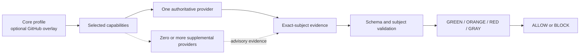

# Guardrails v2 architecture

Guardrails evaluates vendor-neutral capabilities while naming the provider that
produced each result. It does not run third-party services, reinterpret their
findings, or treat configuration as evidence.

## Contract layers

| Layer | Source | Responsibility |
| --- | --- | --- |
| Capability catalog | `policies/control-catalog.yaml` | Defines the engineering outcome, lifecycle stage, availability, and required subject type. |
| Profiles | `policies/profiles.yaml` | Selects runnable capabilities and advisory defaults for `change` and `release`. |
| Providers | `policies/provider-config.yaml` | Maps tools to capabilities, check names, workflows, secrets, and authoritative/supplemental selections. |
| Repository policy | `.guardrails/policy.yaml` | Selects profiles and repository-specific mode overrides. |
| Evidence | `.artifacts/guardrails/evidence*.json` | Records provider results for one exact commit, pull-request state, artifact, or environment. |
| Evaluator | `.guardrails/evaluate.py` | Validates contracts and determines readiness and allow/block. |

## Evaluation flow



Exactly one authoritative provider can satisfy or block a selected capability.
Supplemental providers are displayed for comparison and migration, but remain
advisory regardless of their result.

Each provider/capability pair has one GitHub evidence contract: either a check
run or a pull-request review. A provider can use different contract types for
different capabilities, but overlapping check and review definitions for the
same capability are invalid and rejected before collection.

## Runnable profiles

Core is selected by default and is portable across Git hosts. It covers:

- repository, documentation, ground-truth, change-scope, and PR-metadata validation;
- repository-defined build, unit-test, changed-code coverage, format/lint, and migration-validation commands;
- tokenless Semgrep CE with repository-owned tested rules;
- Gitleaks CLI secret detection.

Local command producers report an absent command as `not_run`. In GitHub
Actions, format/lint and migration validation always retain their named jobs and
fail when the command is absent. This fail-closed behavior prevents either
context from satisfying a ruleset through GitHub's skipped-job semantics.

The optional GitHub profile is additive. Its runnable scorecard paths cover
CodeQL, Dependency Review, GitHub Secret Protection, and Dependabot
verification. It also installs an artifact-attestation workflow for releases,
but that workflow does not yet emit nested artifact evidence or feed a release
scorecard. Artifact provenance therefore remains incomplete as a Guardrails
runtime path. Both profiles default every selected capability to `advisory`.

SonarQube, Snyk, Semgrep AppSec Platform, FOSSA, Codex Code Review, other AI review adapters, and a
repository soak command are provider definitions, not runnable profiles. A
repository activates them with a mode override and provider selection after it
implements the required adapter.

Catalog controls also declare an `enforcement_policy`. Most deterministic
controls are `promotable`; all AI review controls are `advisory-only`. The
evaluator rejects policy that attempts to make an advisory-only control an
enforced merge gate.

## Evidence boundary

Evidence uses a nested capability/provider shape:

```json
{
  "version": 2,
  "subject": {
    "type": "git-commit",
    "revision": "0123456789abcdef0123456789abcdef01234567"
  },
  "results": {
    "unit-tests": {
      "repository-unit-tests": {
        "producer": "Repository Unit Test Command",
        "status": "passed",
        "evidence": ["command: python3 -m unittest"]
      }
    }
  }
}
```

The evaluator requires an exact subject match. Git commit evidence cannot
satisfy pull-request, artifact, or environment capabilities. `passed` and
`failed` require evidence records; `blocked` and `not_run` require a reason.

Mutable PR metadata uses a separate `pull-request` subject whose revision is a
digest of repository, PR number, head SHA, update time, title, and body. This
prevents a title or body edit from reusing evidence produced for earlier PR
state while preserving commit-bound build and test evidence. Its trusted
`pull_request_target` workflow publishes a run-bound custom check whose
`head_sha` is the candidate commit; the base-SHA workflow job is not the
promotable merge context.

GitHub collection additionally verifies the exact check name/head/app, workflow
run name and declared path (including GitHub's optional `@ref` suffix),
pull-request event and exact PR-head association, and configured external-ID/run
binding when present. Native Actions checks also require their workflow-run
check suite and exact workflow definition at the trusted base. Provider
contracts can extend that trust boundary with
`trusted_paths`, covering candidate-controlled validator code, rule packs, and
fixtures that define the check result. The collector compares every declared
path at the exact PR head and trusted base revision; a missing, changed, or
unverifiable path becomes `not_run`. Custom checks published by a trusted
`pull_request_target` probe do
not claim the probe's base-SHA workflow suite is the custom PR-head check suite.
A configured GitHub review provider is instead bound by exact review author and
`commit_id`. A missing, skipped, stale, ambiguous, or unproven check or review becomes `not_run`, never
`passed`.

## Status and decision

| Readiness | Condition | Decision effect |
| --- | --- | --- |
| `GREEN` | Authoritative evidence passed for the exact subject. | Satisfies the capability. |
| `ORANGE` | Advisory capability lacks a passing authoritative result. | Reported; does not block. |
| `RED` | Enforced capability lacks a passing authoritative result, or evidence targets the wrong subject. | Blocks. |
| `GRAY` | Capability is not activated for the operation and subject type. | Excluded. |

The overall status is `RED` when blocked, otherwise `ORANGE` when any advisory
capability is unresolved, otherwise `GREEN`. Default evaluation omits inactive
and `evidence-only` controls; `--all-catalog-controls` includes them as `GRAY`
rows for catalog inspection.

## Installation boundary

The shared repository owns canonical schemas, runtime, workflows, and starter
configuration. A consumer owns `.guardrails/policy.yaml`,
`.guardrails/providers.yaml`, documentation mappings, change-scope thresholds,
ground-truth paths, command variables, credentials, and ruleset activation.

Ground-truth documents stay in the consumer and may use any existing relative
paths. Guardrails validates the declared inventory; it does not require a fixed
set of root-level filenames.

## Evidence-only lifecycle capabilities

Container vulnerability, IaC misconfiguration, artifact SBOM, artifact
vulnerability, deployment policy, dynamic application security, and runtime
assurance are catalog/evidence contracts only. They are not selectable in a
runnable profile and cannot be activated by policy. Future implementations
must add providers and exact-subject evidence before these capabilities become
runnable.

See [Guardrails standard](guardrails.md), [producer contract](producer-contract.md),
and [control status](control-status.md).
