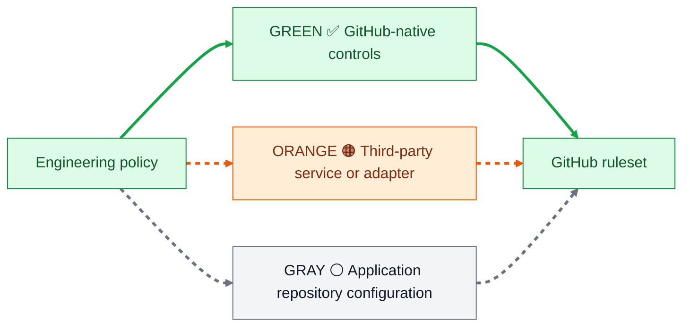

# Control status

This page answers two separate questions: **what enforcement mode did the
repository select, and what happened in this scan?**

## Status meanings

| Readiness | Meaning | Merge behavior |
| --- | --- | --- |
| **🟢 GREEN — producer passed** | The selected producer returned passing evidence for this revision. | Satisfies the policy mode. |
| **🟠 ORANGE — no result** | The repository selected the control, but its producer has not returned usable evidence. | Visible; blocks only when enforced. |
| **⚪ GRAY — not activated** | The catalog describes the control, but this repository did not select it. | Informational only. |
| **🔴 RED — failed or blocked** | The producer failed, was blocked, or enforced evidence is missing. | Blocks when enforced. |

The report keeps producer category separate from readiness: `github-native`,
`external`, or `repository`. For example, SonarQube and Snyk are `external`
producer categories, while CodeQL is `github-native`. Either can be GREEN only
after it is selected and produces passing evidence.

## Activation map



## Control map

| Control | Finds | Activation | What a consuming repository must do |
| --- | --- | --- | --- |
| Repository validation | Broken policy, schema, documentation, and repository contracts | ✅ Green | Run the shared validator or equivalent check. |
| Documentation validation | Broken internal links and documentation contracts | ✅ Green | Run the shared documentation validator. |
| Ground Truth | Missing application-owned architecture, standards, testing, security, deployment, or contribution documents | ⚪ Gray | Declare the repository's actual ground-truth files and run the installed validator. |
| Change Scope | Oversized or unexpectedly broad changes | ✅ Green | Configure thresholds and review advisory findings. |
| Guardrail evaluator | Missing or failed revision-bound evidence | ✅ Green | Produce evidence using the shared schema and invoke the evaluator. |
| Build | Compilation, packaging, and build regressions | ✅ Green | Set the build command and runtime/toolchain. |
| Unit Tests | Functional regressions and changed behavior | ✅ Green | Set the test command and coverage report. |
| SonarQube | Bugs, maintainability, code quality, and new-code regressions | 🟠 Orange | Provide the project, token, quality gate, and PR analysis. |
| CodeQL / SAST | Vulnerabilities in application code | ✅ Green | Set supported languages and enable the GitHub security workflow. |
| Secrets scan | Credentials and tokens committed to code | ✅ Green when enabled / 🟠 ORANGE until verifiable | Enable GitHub secret scanning and push protection. The PR verifier also needs `SECURITY_SETTINGS_TOKEN` because GitHub exposes these admin-only settings only to an administrator. |
| Dependency Review | Risk introduced by changed dependencies | ✅ Green | Enable the GitHub workflow and define severity/license policy. |
| Snyk Open Source | Dependency vulnerabilities and supply-chain risk | 🟠 Orange | Connect `SNYK_TOKEN`, a Snyk project, policy, and the PR workflow; advisory by default. |
| Snyk Code | Vulnerabilities in application source code | 🟠 Orange | Connect `SNYK_TOKEN` and run the source scan on every PR; advisory by default. |
| Artifact Provenance | Signed evidence of how a release artifact was built | 🟠 Orange | Call `workflows/artifact-provenance.yml` with a real artifact; verify it at release/deploy before promoting the control. |
| FOSSA | Open-source dependency, license, and supply-chain risk | 🟠 Orange | Create the FOSSA project, credentials, policy, and adapter command. |
| Semgrep | Organization-specific security patterns | 🟠 Orange | Supported advisory control. Add `SEMGREP_APP_TOKEN` and the organization-approved Semgrep workflow/adapter; until then it remains not activated. |
| Soak Check | Runtime degradation over time | ⚪ Gray | Provide workload, duration, metrics, thresholds, and revision evidence. |
| AI Engineering Review | Correctness, architecture, maintainability, and regression risk | 🟠 Orange | Connect a trusted provider-neutral review adapter. |
| AI QA Review | Missing tests, edge cases, and weak assertions | 🟠 Orange | Connect the QA review adapter and result contract. |
| AI Security Review | Auth, tenant isolation, injection, secrets, and privilege risks | 🟠 Orange | Connect the security review adapter and result contract. |
| AI Repo Standards Review | Violations of application ground truth | 🟠 Orange | Expose repository documents to the review adapter. |
| Default-branch protection | PR, optional approval, status-check, and conversation requirements | ✅ Green | Import, adapt, and activate the GitHub ruleset in the target repository. The default requires PRs but zero approvals; raise `required_approving_review_count` for teams or higher-risk repositories. |

## The green path

This is the part that is already executable in the shared repository:

```text
Policies and control catalog
        ↓
JSON/YAML schemas
        ↓
Guardrail evaluator
        ↓
Repository validation workflow
        ↓
Evidence-backed pass or fail
```

The workflow templates and ruleset are not globally active just because they
are stored here. A green control becomes active in an application repository
only after that repository installs it, supplies its repository-specific
configuration, observes the actual check name, and adds it to the ruleset.

## Configuration checklist

Before turning a configurable control into a required merge check, verify:

- A real producer runs on the intended event.
- The producer checks the exact revision under review.
- The output has a stable status/check name.
- Failure and missing evidence fail closed.
- Required secrets and permissions are configured.
- The result is visible to the repository ruleset.
- An owner is responsible for fixing failures.
- The control has passed on representative pull requests.

For the source of truth, see the [control catalog](../policies/control-catalog.yaml).
