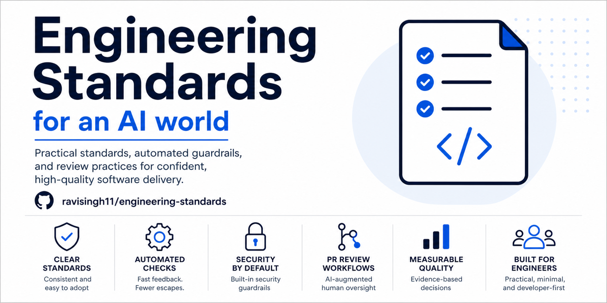

# Python Guardrail Example

This directory is a deliberately small Python application that demonstrates
how to consume [Guardrails](../../README.md).
It is an executable reference for installation, provider setup, pull-request
checks, evidence collection, and scorecard reporting.



The application has:

- `app.py` — production code.
- `test_app.py` — standard-library unit tests.
- `AGENTS.md` — repository-specific ground truth.
- `tools/run_guardrails.py` — a sample test producer that writes revision-bound
  evidence for the shared scorecard.
- `CONTRIBUTORS.md` — project attribution, including Codex-assisted engineering.

## Run the example

From `examples/python-demo`, run the committed example immediately:

```sh
python3 tools/run_guardrails.py
python3 .guardrails/scan.py --all-catalog-controls
```

### Local scan versus GitHub Actions

Run locally for quick feedback. Treat the GitHub Actions result on the pull
request as authoritative because it runs in a clean environment against the
exact PR revision and publishes the checks, scorecard, and artifact.

```text
Local scan → fix issues → open PR → GitHub Actions → review checks → merge
```

The standards repository is installed from source; a generated report artifact
is evidence, not an installer. To install or refresh this committed example
from the project root, run:

```sh
python3 tooling/install.py \
  --target examples/python-demo \
  --github-actions \
  --refresh-existing
cd examples/python-demo
python3 tools/run_guardrails.py
python3 .guardrails/scan.py --all-catalog-controls
```

For a new application repository, omit `--refresh-existing`. Use
`--dry-run` to preview the files before installing them. For control selection
and provider setup, continue with the shared repository's
[quick start](../../docs/quickstart.md).

`--refresh-existing` updates shared runtime files and standard workflow
templates without overwriting consumer-owned policy, producer manifest, or
provider workflows. It also migrates the former `.agentic-guardrails/`
runtime and `agentic-guardrails-scorecard.yml` workflow to their canonical
`.guardrails/` names. Use `--dry-run` to preview changes or `--no-cleanup` to
defer legacy cleanup. Repository policy, provider credentials, and
repository-specific workflows remain locally owned.

The nested `.github/workflows/` files are installation examples. GitHub does
not execute workflows from a nested example directory. The root repository CI
runs this example's tests and validator; when installed into its own repository,
the copied workflows run repository-owned producers first—validation, build,
unit tests, and dependency review. The scorecard workflow then uses
`.guardrails/github_evidence.py` to collect
visible GitHub check results for the exact revision before the scorecard runs.
The installed `.guardrails/producer-manifest.json` is the explicit mapping between
controls and those check names. Missing or skipped producers remain `NO RESULT`;
they are never treated as passes.

The scan prints a detailed report and writes a timestamped Markdown report to:

```text
.artifacts/guardrails/scorecard-*.md
```

To inspect the latest report immediately after a local run:

```sh
latest_report="$(find .artifacts/guardrails -maxdepth 1 -name 'scorecard-*.md' -print | sort | tail -n 1)"
test -n "$latest_report" && less "$latest_report"
```

`GREEN` means the producer passed for the exact revision. `ORANGE` means the
control is selected but has no passing result yet. `GRAY` means it is not
selected. `RED` means the producer failed or was blocked; with this demo's
advisory policy, RED findings are reported without stopping the workflow.

The sample harness produces revision-bound evidence for these repository-native
controls:

- Repository validation
- Documentation validation
- Build / Python compilation
- Unit tests
- Change-scope inspection

These controls are selected as advisory in `.guardrails/policy.yaml`, so the demo
can show GREEN evidence locally and in pull requests without blocking on
unconfigured services. External providers such as SonarQube, Snyk, FOSSA, and
AI review remain ORANGE until their real producers and credentials are
configured.

`.artifacts/` is intentionally ignored because reports and evidence are
generated files. In GitHub Actions, the workflow uploads the evidence and
scorecard as the `guardrail-scorecard-<run-id>` artifact. Open the workflow run
in the Actions tab and download that artifact to inspect the report.

The Snyk workflow is included but not activated. To connect it in a consuming
repository, enable the provider and add a Snyk API token as the GitHub Actions
secret `SNYK_TOKEN`; never commit the token or place it in a workflow file.
The workflow then runs Snyk Code on every PR and Snyk Open Source when a
supported dependency manifest is present. Keep both controls advisory while
tuning the integration.

For pull requests, the workflow also creates or updates a single
**Engineering Standards Guardrail Scan** comment containing the full Markdown
scorecard. Fork pull requests may not receive a comment because GitHub limits
write permissions for workflows triggered from forks; the job log and artifact
remain available in that case.

The scorecard is an evidence report, not a claim that every provider is
installed. `GREEN` means a real producer passed for the exact revision;
`ORANGE` means the selected control is advisory and needs provider setup or
has no result; `GRAY` means the control is not selected. A control becomes
blocking only when its policy is `enforced` and its producer/check is also
configured in the consuming repository.

The demo also connects the Codex review to the scorecard. It only reports
`ai-engineering-review` as GREEN when the configured Codex reviewer has
reviewed the exact current PR head commit. A review of an older commit does
not count.

## Pull requests

This directory includes the refreshed shared runtime and scorecard workflow as
an end-to-end installation example.

The `Guardrail Scorecard` workflow runs on every pull request. It checks out
the exact PR head revision, runs the unit tests, records revision-bound
evidence, evaluates the selected policy, and prints the timestamped Markdown
scorecard in the Actions log. The selected controls are advisory so
unconfigured integrations remain visible without blocking iteration. Promote a
control to `enforced` only after its producer, credentials, exact check name,
and ruleset entry have been verified.

To refresh the installed runtime after a standards release, clone or update
the standards repository beside this repository and rerun the installer
command above. `--refresh-existing` updates shared product files while
preserving the repository policy and existing consumer workflow. Review
workflow changes before committing them.
